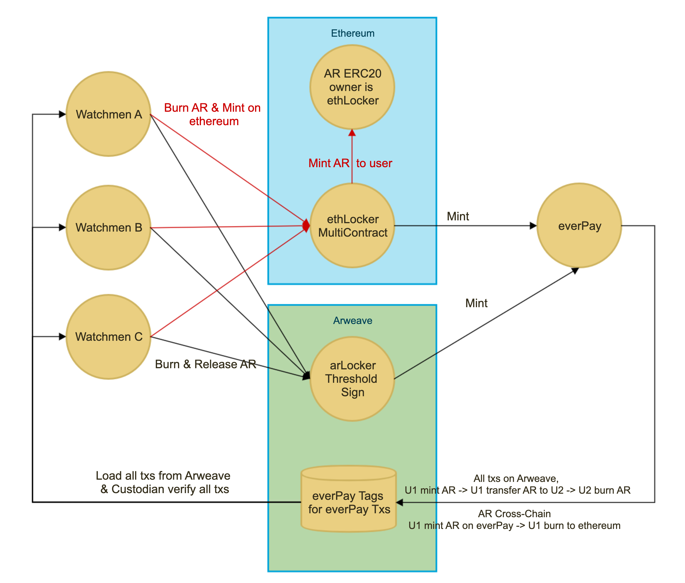
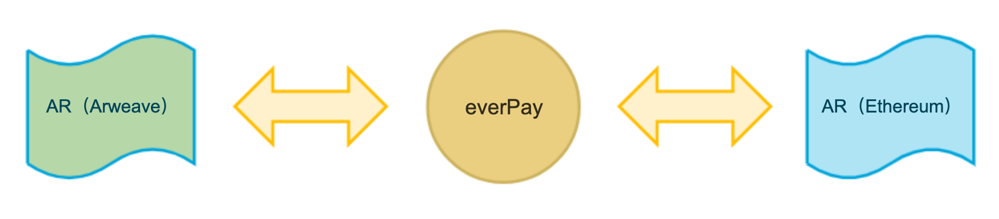

# 使用 everPay 完成 AR 跨链

## 概述

everPay 可以作为跨链桥将 Arweave 上的 AR 代币等额映射到 Ethereum 上。

everPay 是一个基于 Arweave 构建的跨链的代币支付结算协议（[everPay 原理](https://medium.com/everfinance/everpay-a-trusted-cross-chain-payment-protocol-eba4a0af7d66)）。everPay 的数据共识由 Arweave 进行保障，保管人（原来叫资管者 Asset Manager）通过验证在 Arweave 上的 everPay 交易对跨链进行签名。

## 工作原理

everPay 的所有账本透明的记录在 Arweave 上，由多个保管人共同维护账本。

ethLocker 是 everPay 在以太坊上的多签资管合约，ethLocker 可以执行任意的以太坊操作。保管人根据 Arweave 上的交易生成提案执行以太坊多签。

一种最常见的提案是用户提现 ETH/ERC20，提案在第 4 步产生：

1. 用户1 将 ETH 转入 ethLocker
2. everPay 为用户1 映射出等值的 ETH（ever）
3. 用户1 将 ETH（ever）转给用户2
4. 用户2 Burn ETH（ever）

1-4 的每笔交易都会序列化存储在 Arweave 上。第 4 步用户2 的 Burn 事件形成了一个 ETH 提现的提案。每个保管人都通过 Arweave 的数据验证所有交易过程，并确保 Burn 提案的正确性，然后才签署一份提现指令发送到 ethLocker 合约。

### AR（ever）

与 Ethereum 上的多签不一样的是，everPay 使用门限签名技术保管 AR（Arweave），将 AR（Arweave）映射到 everPay 中生成等额的 AR（ever）。

### AR（Arweave）到 AR（Ethereum）

原有的 AR 提现提案是：

1. 用户1 将 AR 转入 ArLocker
2. everPay 为用户1 映射出等值的 AR（ever）
3. 用户1 Burn AR（ever）

保管人验证 Arweave 数据，获得 AR Burn 提案，多签释放  ArLocker 中的 AR。

#### 跨链改进

部署一个 AR（ERC20）到 Ethereum，ERC20 的 mint owner 为 ethLocker。

改进原 AR 提案，新增一个 BurnToEthereum 提案：

1. 用户1 将 AR 转入 ArLocker
2. everPay 为用户1 映射出等值的 AR（ever）
3. 用户1 BurnToEthereum AR（ever）

保管人验证 Arweave 数据，获得 BurnToEthereum 提案，签署指令： `ethLocker 调用 AR（ERC20）mint 资产到用户1`。

### AR（Ethereum）到 AR（Arweave）

将 AR（Ethereum）充值到 EthLocker 即可获得 AR（ever），用户可以自行选择将 AR（ever）提现到 Arweave 或者 Ethereum。

# 其他

保管人目前有由 everFinance 和 Goblin Pool（GRIN）提供。
